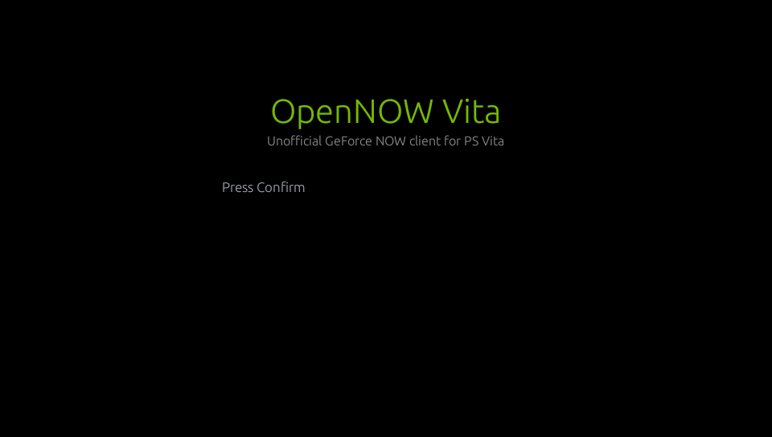

# OpenNOW Vita

[](https://github.com/zero-phoenix/OpenNOW-vita/actions/workflows/build.yml)
[](https://github.com/zero-phoenix/OpenNOW-vita/releases/latest)
[](LICENSE)

🇬🇧 **[This README in English](README.md)** — el mismo contenido, mantenido en paralelo.

**OpenNOW Vita** es un cliente homebrew nativo de **GeForce NOW para la PlayStation Vita**,
escrito íntegramente en Rust. Inicia sesión en tu cuenta de GFN desde la propia consola, lista tu
biblioteca con las portadas, negocia una sesión WebRTC real contra la infraestructura de NVIDIA y
decodifica el vídeo H.264 en el decodificador por hardware de la Vita — con tu mando, y si
quieres con un teclado y ratón completos, reenviados al stream en tiempo real. Una vez dentro no
hace falta ningún PC, teléfono ni navegador.

Este fork de [OpenCloudGaming/OpenNOW-vita](https://github.com/OpenCloudGaming/OpenNOW-vita)
añade **dos perfiles de control intercambiables** — uno que reenvía todos los controles al juego
y otro que convierte las pantallas táctiles, los sticks y los botones de la Vita en un teclado y
ratón para el escritorio remoto, útil para manejar Windows, Steam o Epic en una sesión
**Install-to-Play** de GeForce NOW Ultimate — más un conjunto de arreglos de fiabilidad en la
visibilidad del catálogo de Install-to-Play, la limpieza de sesiones y el enrutado del inicio de
sesión. La lista completa está en [Qué cambia este fork](#qué-cambia-este-fork).

En arquitectura sigue el camino abierto por
[green-vita](https://github.com/Day-OS/green-vita) (Xbox Cloud Gaming en la Vita): SDL2 + egui
para la interfaz, decodificación de vídeo por hardware directa a textura, y empaquetado del VPK
con `cargo-vita`. El trabajo sobre el protocolo de GFN se apoya en
[OpenNOW](https://github.com/OpenCloudGaming/OpenNOW) y en OpenNOW-Switch como referencia.

> **Aviso**: este proyecto **no está afiliado a NVIDIA ni a GeForce NOW**, ni cuenta con su
> respaldo o aprobación. Es un cliente alternativo no oficial. Necesitas tu propia cuenta de
> GeForce NOW para usarlo.

## Contenido

- [Funciones](#funciones)
- [Qué cambia este fork](#qué-cambia-este-fork)
- [Perfiles de control: jugar vs manejar Windows](#perfiles-de-control-jugar-vs-manejar-windows)
- [Inicio de sesión: evitar los logins de socios regionales](#inicio-de-sesión-evitar-los-logins-de-socios-regionales)
- [Estado](#estado)
- [Conseguir una compilación](#conseguir-una-compilación)
- [Requisitos para compilar](#requisitos-para-compilar)
- [Compilar en local](#compilar-en-local)
- [Tests](#tests)
- [Solución de problemas](#solución-de-problemas)
- [Integración continua y releases](#integración-continua-y-releases)
- [Estructura del proyecto](#estructura-del-proyecto)
- [Agradecimientos](#agradecimientos)

## Funciones

- **Inicio de sesión de NVIDIA en la consola** — flujo de código de dispositivo (código QR y
  código corto en un segundo aparato), con los tokens cifrados en reposo (ChaCha20-Poly1305, la
  clave guardada en la Safe Memory de la Vita). Una opción de "forzar login directo de NVIDIA"
  (activada por defecto) se salta el descubrimiento de proveedor del servidor, de modo que el
  cliente siempre entra contra NVIDIA directamente en lugar de contra el socio regional que
  devuelva esa llamada — ver [más abajo](#inicio-de-sesión-evitar-los-logins-de-socios-regionales).
- **Biblioteca de juegos** — tu catálogo de GFN con portadas, búsqueda en el servidor, filtro de
  "juegos que tengo" con selector Mis juegos / Todos, ordenación (jugados recientemente,
  recomendados, título) y favoritos guardados en la tarjeta de memoria, así que sobreviven al
  corte de paginación del catálogo.
- **Consciente de Install-to-Play** — la selección de variante prefiere la que realmente tienes
  (`gfn.library.selected` / estado de propiedad) antes que elegir a ciegas la primera variante de
  id numérico. Así un título cuya variante Install-to-Play/Steam tiene un id no numérico — que
  antes desaparecía de la biblioteca o arrancaba la variante equivocada — aparece y arranca bien,
  y `accountLinked` en la petición de sesión refleja la propiedad real juego por juego.
- **Gestión de sesiones** — creación de sesión en CloudMatch, seguimiento de la posición en la
  cola, sondeo consciente del asiento (vuelve a preguntar directamente al servidor de juego
  asignado en cuanto hay asiento) y limpieza previa de sesiones zombis en **todas** las zonas que
  el cliente conoce, no solo en la fijada — para que una sesión colgada en otra zona no pueda
  bloquearte con un falso "límite de dispositivos alcanzado".
- **WebRTC de verdad** — señalización NVST por WebSocket, oferta/respuesta SDP contra los
  servidores ICE-lite de NVIDIA, DTLS-SRTP y desempaquetado de RTP H.264, todo a través de la
  pila sans-I/O [`rtc`](https://github.com/webrtc-rs/rtc) (sin GStreamer y sin navegador).
- **Decodificación de vídeo por hardware** — `sceAvcdec` decodifica cada unidad de acceso
  directamente a texturas de SDL/GXM (la ruta directa a textura de green-vita: cero asignaciones
  por fotograma, doble búfer, negociación dinámica YUV420/BGR565 según la resolución real del
  stream), con vigilante de vídeo parado y tasa de fotogramas seleccionable.
- **Audio** — paquetes Opus por RTP decodificados con `libopus` y reproducidos por SDL2, con
  búfer de jitter, recuperación de paquetes RED, una etapa de ganancia/realce seleccionable y
  búferes pequeños en audio y vídeo para que ninguna pista se adelante a la otra.
- **Entrada del mando** — el estado completo del gamepad (botones, sticks) enviado 60 veces por
  segundo por el canal de datos `input_channel_v1` de NVST, en formato XInput.
- **El panel trasero como gatillos analógicos** — L2/R2 mapeados al panel de atrás (la Vita no
  tiene gatillos analógicos físicos), con intensidad de gatillo seleccionable, más zonas L3/R3 en
  la pantalla delantera. En el perfil de escritorio el panel trasero pasa a ser el ratón.
- **Teclado dentro del juego** — el IME en línea de la Vita, conectado para que los caracteres y
  las ediciones con Retroceso/Enter/flechas lleguen al stream como pulsaciones reales.
- **Dos perfiles de control** — reenviar todo al juego, o convertir la Vita en teclado y ratón
  para el escritorio de Windows remoto; ver
  [más abajo](#perfiles-de-control-jugar-vs-manejar-windows).
- **Fijado de región** — `src/gfn/regions.rs` permite fijar una zona o región de streaming
  concreta en lugar de aceptar siempre la que NVIDIA asigna por geolocalización, útil cuando la
  zona elegida automáticamente no es el mejor enlace para tu proveedor.
- **Resistencia de la sesión** — el sondeo de CloudMatch tolera errores transitorios del servidor
  (respuestas 5xx aisladas del balanceador de zona de NVIDIA) en vez de abortar una sesión que
  habría salido bien en el siguiente intento; y al desconectar se cierra la sesión en el servidor
  en lugar de dejarla colgada.
- **Estimación del enlace** — el cliente recuerda lo que la red entregó de verdad en sesiones
  anteriores y pide un techo de bitrate que el enlace ha llegado a alcanzar, en lugar de una cifra
  fija que cuesta los primeros segundos de cada sesión en paquetes perdidos y caídas de
  resolución.
- **Barra dentro del stream** — salir, estadísticas (kbps/pérdida/RTT), ajustes de control y
  conmutadores de trackpad y teclado, plegable para que no estorbe a la imagen.
- **Ajuste de plataforma** — relojes de CPU y GPU subidos a un perfil de streaming, y afinidad
  explícita de hilos a núcleos entre los tres núcleos de usuario de la Vita, para que el bucle de
  la interfaz, la decodificación de vídeo y la red dejen de pelearse por el mismo.
- **Selector de idioma** — un icono de engranaje junto al avatar de la cuenta cambia la interfaz
  entre inglés, español, francés y ruso (se pueden añadir más en `src/i18n/`); la elección se
  guarda y se restaura al volver a abrir.

## Qué cambia este fork

Respecto al upstream [OpenCloudGaming/OpenNOW-vita](https://github.com/OpenCloudGaming/OpenNOW-vita),
este fork añade:

1. **[Dos perfiles de control](#perfiles-de-control-jugar-vs-manejar-windows)** — un perfil
   *juego* que reenvía cada stick, botón y gatillo al título sin tocar nada, y un perfil
   *escritorio* que convierte la Vita en ratón y teclado para la sesión de Windows en la que
   arrancan los títulos Install-to-Play, con un ojo siempre visible para cambiar entre ambos a
   mitad del stream y un manual en pantalla para cada uno.
2. **Arreglos de catálogo y arranque en Install-to-Play** — los títulos que tienes en una tienda
   vinculada (Steam, Epic) cuya variante Install-to-Play tiene un id no numérico ya no
   desaparecen de la biblioteca ni arrancan con la variante equivocada; `accountLinked` refleja la
   propiedad real en vez de un valor fijo.
3. **Limpieza de sesiones zombis entre zonas** — una sesión abierta en una zona distinta de la
   fijada (tras un cierre inesperado, o tras jugar al mismo juego desde un PC) ya no produce un
   falso "límite de dispositivos alcanzado" en el siguiente intento.
4. **[Login directo de NVIDIA](#inicio-de-sesión-evitar-los-logins-de-socios-regionales)** — una
   forma de saltarse el descubrimiento de proveedor del servidor, para que el inicio de sesión no
   acabe silenciosamente en manos de un socio regional de marca blanca.
5. **CI con GitHub Actions** — cada push y cada pull request compila un `.vpk` real de Vita dentro
   del contenedor oficial de VitaSDK, y cada etiqueta `v*` lo publica como una release de GitHub
   con las notas sacadas directamente de `CHANGELOG.md`: se acabó compilar a mano para pasarle a
   alguien un `.vpk` que funcione.
6. **[Tests que se ejecutan de verdad](#tests)** — el mapeo de entrada y el formato de cable de
   NVST viven en `opennow-core`, un crate sin dependencias que compila en cualquier PC. Antes de
   la 0.6.0 `cargo test` no podía ni compilar: el binario enlazaba `libopus` de ARM y un SDL2
   estático sin condición alguna, y no había target de librería, así que "verificado" solo podía
   significar "compiló". Ahora son 73 tests en menos de un segundo — y la primera vez que se
   ejecutaron encontraron un bug real.

En `CHANGELOG.md` está el historial completo y fechado de todos los cambios, incluido lo heredado
del upstream.

## Perfiles de control: jugar vs manejar Windows

Una sesión **Install-to-Play** de GeForce NOW no te deja dentro de un juego: te deja dentro de un
**escritorio de Windows 11**, donde hay que pasar por Steam o por el lanzador de Epic antes de
que el juego arranque. Ahí un mando no sirve de nada, y una vez empieza el juego un ratón tampoco.
La Vita tiene que ser las dos cosas, y tiene que poder cambiar sin cortar la sesión.

Lo que no puede es ser las dos cosas **a la vez**. La Vita no tiene gatillos L2/R2 físicos —
existen solo como zonas del panel táctil trasero — así que "el panel de atrás es el ratón" y "el
panel de atrás es L2/R2" se excluyen de verdad. En lugar de hacer las dos a medias y dejarte con
una versión poco fiable de cada una, este fork tiene **dos perfiles de control explícitos** y
cambiar entre ellos es un solo toque:

| | **Perfil juego** (por defecto) | **Perfil escritorio** |
|---|---|---|
| Sticks | al juego | izquierdo = cursor fino, derecho = rueda de scroll |
| Cruceta | al juego | flechas, con repetición al mantener |
| Botones frontales | al juego | ✕/○ = clic izquierdo/derecho (mantenido), △ = Enter, □ = Retroceso |
| L / R | L1 / R1 | L = modo precisión (½ sensibilidad), R = doble clic |
| Panel trasero | L2 / R2, con presión graduada | cursor del ratón + clic (mitad izquierda / derecha) |
| Esquinas inferiores | L3 / R3 | modificadores y tira de teclas |
| Borde superior | `ESC` `⏎` `⌨` `ALT+F4` | tira de teclas completa |
| SELECT / START | al juego | teclado en pantalla / tecla Windows |

El perfil juego reenvía **todo** al título, sin tocar nada — es byte a byte lo mismo que obtienes
con el overlay apagado, y eso es lo que hace que títulos de la talla de Death Stranding o Silent
Hill f se puedan jugar de verdad con el overlay todavía en pantalla. Hay un test que lo impone: si
una edición futura reasigna algún control ahí, `the_game_profile_forwards_every_control` falla
antes de que el cambio llegue a una consola.

Las cuatro teclas del borde superior son la única excepción, y al mando no le cuestan nada: NVST
no transporta el táctil al juego, así que en el perfil juego la pantalla delantera es espacio
muerto de todas formas. Se disparan cuando el dedo **se levanta**, y solo tras una pulsación
corta y quieta — un pulgar apoyado en el borde superior mientras juegas no manda un Escape al
juego.

### El ojo

En la esquina superior derecha de la pantalla delantera hay siempre un **ojo** semitransparente.
Está dibujado con una opacidad mínima más alta que todo lo demás, a propósito: es el camino de
vuelta, así que nunca debe poder desvanecerse dentro de la imagen.

- **Toca el ojo** — muestra u oculta todo el overlay.
- **Toca el conmutador justo debajo del ojo** — cambia entre el perfil juego y el de escritorio.
  Está activo en los dos perfiles, así que no puedes quedarte encerrado en modo juego sin salida.
- Tras un **cambio de perfil**, un manual de controles minimalista aparece cuatro segundos en el
  centro de la pantalla, con lo que hace cada stick y cada botón en el perfil al que *acabas* de
  entrar. Se genera desde la tabla de asignaciones, así que no puede describir una distribución
  que el cliente no tiene, y no se queda: la 0.5.0 lo dibujaba de forma permanente, en **los
  dos** perfiles, lo que ponía una tarjeta de texto sobre la imagen durante toda la sesión.

En el perfil juego la tira de teclas **baja al 35 % de opacidad tras seis segundos sin tocarla** y
vuelve al instante en cuanto tocas la pantalla — siempre visible, sin competir con la imagen. El
overlay encendido/apagado, mostrado/oculto, el perfil activo, la opacidad (cinco pasos, Fantasma →
Fuerte), el atenuado por inactividad y la sensibilidad del ratón son preferencias persistentes en
**Ajustes → Controles**.

### Distribución de la pantalla delantera (perfil juego)

Cuatro teclas en una tira de 44 px arriba, y nada más sobre la imagen. `EYE` es el conmutador de
mostrar/ocultar y `SW` el de cambio de perfil, justo debajo. `L3`/`R3` son las esquinas
inferiores, y siguen activas incluso con el overlay oculto: son botones del mando, no controles
del overlay.

```
+-------------------------------------------------+------+
|    ESC        ENTER         KB        ALT+F4    | EYE  |
+-------------------------------------------------+------+
|                                                 |  SW  |
|                                                 +------+
|                                                        |
|                 la imagen, sin tocar                   |
|                                                        |
+--------------+--------------------------+--------------+
|      L3      |                          |      R3      |
+--------------+--------------------------+--------------+
```

### Distribución de la pantalla delantera (perfil escritorio)

Las teclas viven en dos tiras finas en los bordes superior e inferior más dos carriles
deslizantes estrechos, lo que deja **todo el centro del panel de 960×544 libre**. El diseño
anterior de la 0.4.x ponía zonas en los cuatro bordes **y** en las dos esquinas inferiores:
enmarcaba la imagen y robaba las esquinas que necesitan las zonas de stick.

```
+------+-----+-----+------+-----+-----+-----+-----+------+
| ESC  | TAB | WIN |A+TAB |COPY |PEGAR| KB  | AJU | EYE  |
+------+-----+-----+------+-----+-----+-----+-----+------+
|                                                 |  SW  |
|DPI |                                              |SCR |
| ^  |      la imagen: nada encima del centro       | ^  |
| v  |                                              | v  |
+-------+------+------+------+------+------+------+------+
| SHIFT | CTRL | ALT  |ENTER | RETR | SUPR |ATAJOS|C-A-D |
+-------+------+------+------+------+------+------+------+
```

Shift/Ctrl/Alt son modificadores **pegajosos**, compartidos con el estado de modificadores del
teclado en pantalla, así que `Ctrl` y luego una letra del teclado es un acorde real — y los cuatro
modificadores, Shift incluido, se envían como teclas mantenidas de verdad, que es lo que hace que
`Ctrl+Shift+Esc` llegue siquiera al anfitrión. `ATAJOS` abre una página de atajos de Windows de un
solo toque (Inicio, mostrar escritorio, Explorador, vista de tareas, Alt+Tab, Alt+F4,
administrador de tareas, bloquear, y el resto).

Todas las zonas de arriba salen de una sola tabla `const` en `core/src/input/layout.rs`, que leen
**tanto** el dibujado como la detección de toques. Eso es deliberado: antes eran dos funciones
"derivadas de las mismas constantes", que no es lo mismo, y es así como un botón acaba dibujado
donde no se puede pulsar. Tres tests sostienen la línea — ninguna zona activa se solapa con otra,
nada puede tapar nunca el ojo, y cada zona dibujada responde en su propio centro.

### La geometría exacta

Sacada de esa misma tabla. Las coordenadas están normalizadas (0–1) en el código fuente; la
columna de píxeles son esos valores sobre el panel de 960×544 de la Vita. "Activa cuando" es la
condición de `Live::is_live`: `siempre` ignora por completo si el overlay está mostrado,
`mostrado` necesita que lo esté en cualquiera de los dos perfiles, y `juego + sticks` es
independiente de eso porque L3/R3 son botones del mando.

| Zona | Activa cuando | x0,y0 – x1,y1 (normalizado) | en píxeles |
|---|---|---|---|
| `Eye` | siempre | 0.880,0.000 – 1.000,0.110 | 845,0 – 960,60 |
| `ModeToggle` | mostrado | 0.880,0.110 – 1.000,0.220 | 845,60 – 960,120 |
| `Esc` | juego | 0.000,0.000 – 0.220,0.080 | 0,0 – 211,44 |
| `Enter` | juego | 0.220,0.000 – 0.440,0.080 | 211,0 – 422,44 |
| `Keyboard` | juego | 0.440,0.000 – 0.660,0.080 | 422,0 – 634,44 |
| `AltF4` | juego | 0.660,0.000 – 0.880,0.080 | 634,0 – 845,44 |
| `Esc` | escritorio | 0.000,0.000 – 0.110,0.110 | 0,0 – 106,60 |
| `Tab` | escritorio | 0.110,0.000 – 0.220,0.110 | 106,0 – 211,60 |
| `Win` | escritorio | 0.220,0.000 – 0.330,0.110 | 211,0 – 317,60 |
| `AltTab` | escritorio | 0.330,0.000 – 0.440,0.110 | 317,0 – 422,60 |
| `Copy` | escritorio | 0.440,0.000 – 0.550,0.110 | 422,0 – 528,60 |
| `Paste` | escritorio | 0.550,0.000 – 0.660,0.110 | 528,0 – 634,60 |
| `Keyboard` | escritorio | 0.660,0.000 – 0.770,0.110 | 634,0 – 739,60 |
| `Settings` | escritorio | 0.770,0.000 – 0.880,0.110 | 739,0 – 845,60 |
| `Shift` | escritorio | 0.000,0.890 – 0.125,1.000 | 0,484 – 120,544 |
| `Ctrl` | escritorio | 0.125,0.890 – 0.250,1.000 | 120,484 – 240,544 |
| `Alt` | escritorio | 0.250,0.890 – 0.375,1.000 | 240,484 – 360,544 |
| `Enter` | escritorio | 0.375,0.890 – 0.500,1.000 | 360,484 – 480,544 |
| `Backspace` | escritorio | 0.500,0.890 – 0.625,1.000 | 480,484 – 600,544 |
| `Delete` | escritorio | 0.625,0.890 – 0.750,1.000 | 600,484 – 720,544 |
| `Shortcuts` | escritorio | 0.750,0.890 – 0.875,1.000 | 720,484 – 840,544 |
| `CtrlAltDel` | escritorio | 0.875,0.890 – 1.000,1.000 | 840,484 – 960,544 |
| `DpiSlider` | escritorio | 0.000,0.300 – 0.070,0.720 | 0,163 – 67,392 |
| `ScrollSlider` | escritorio | 0.930,0.300 – 1.000,0.720 | 893,163 – 960,392 |
| `StickLeft` | juego + sticks | 0.000,0.800 – 0.250,1.000 | 0,435 – 240,544 |
| `StickRight` | juego + sticks | 0.750,0.800 – 1.000,1.000 | 720,435 – 960,544 |

Lo que deja, en el perfil escritorio, un rectángulo limpio de **67,60 a 893,484** — 826×424 de los
960×544 del panel, el 67 % de su superficie, sin nada dibujado encima. En el perfil juego todo lo
que está por debajo de y=44 está limpio salvo las dos esquinas inferiores.

### El panel trasero como ratón

El panel de atrás es la única superficie que cambia de significado por completo entre los dos
perfiles:

```
Perfil juego
+----------------------------+---------------------------+
|             L2             |            R2             |
|    0..255 según lo alto    |    0..255 según lo alto   |
|     que toques el panel    |    que toques el panel    |
+----------------------------+---------------------------+

Perfil escritorio
+--------------------------------------------------------+
|   arrastrar en cualquier sitio = mover el cursor       |
+----------------------------+---------------------------+
|    toque = clic IZQUIERDO  |   toque = clic DERECHO    |
+----------------------------+---------------------------+
```

El protocolo de entrada de NVST solo tiene un paquete de movimiento de ratón **relativo**
(`INPUT_MOUSE_MOVE_REL`, limitado a ±4096 por eje): no existe ningún paquete de posición absoluta
que pudiera llevar el cursor del anfitrión a un punto exacto. Por eso el panel trasero se mapea
como un **trackpad relativo**: arrastrar mueve el cursor un delta, como el trackpad de un
portátil, no un mapa 1:1 de toque a píxel. Un multiplicador de sensibilidad configurable escala
ese delta, y mantener **L** lo reduce a la mitad para trabajo fino.

También **hace clic**: un toque en la mitad izquierda es clic izquierdo, en la derecha es clic
derecho. Versiones anteriores se negaban a propósito a hacer clic desde el panel trasero, con el
argumento de que el panel no se ve y un toque accidental sería difícil de notar. En la práctica
pasaba lo contrario: sin clic trasero no había forma de hacer clic sin tapar la imagen con un
pulgar. La salvaguarda es que el clic solo se dispara si el dedo se levanta antes de **300 ms**
**y** ha recorrido menos del **5 %** del panel; cualquier cosa más lenta o más larga es un
arrastre del cursor y no hace clic.

### Rueda del ratón

`INPUT_MOUSE_WHEEL` se añadió a `src/gfn/input_protocol.rs` (hoy `core/src/protocol.rs`),
portado del formato de cable de los clientes de referencia OpenNOW / OpenNOW-Switch en lugar de
inventado, y se emite en muescas enteras de ±120 (la convención `WHEEL_DELTA` que espera Windows).
Lo mueven tanto el stick derecho como el carril deslizante de la derecha.

### Calidad de imagen

El stream ya se pide a la resolución **nativa 960×544** del panel, con filtrado lineal y color de
32 bits, así que no quedaba resolución por ganar. Lo que sí quedaba era bitrate: el techo
adaptativo estaba limitado a 12 Mbps, y a resolución nativa cada artefacto del codificador cae
sobre un píxel real, sin ningún reescalado que lo disimule — que es lo que se veía como papilla en
escenas oscuras y con mucho movimiento. La 0.5.0 sube el techo a **20 Mbps** (estimación de primer
arranque 8 → 12). Esto solo cambia el máximo al que la estimación medida puede llegar; el camino
de bajada no se toca, así que un enlace débil sigue bajando igual de rápido.

Dónde está el código — casi todo ya en `core/`, donde lo cubren los tests:

| Archivo | Qué vive ahí |
|---|---|
| `core/src/input/layout.rs` | La tabla de zonas, y la detección de toques que la lee |
| `core/src/input/router.rs` | `route_touch()`: de quién es este dedo, en un orden de precedencia escrito |
| `core/src/input/bindings.rs` | Qué significa cada control en cada perfil; el manual en pantalla se genera de aquí |
| `core/src/input/mapper.rs` | Sticks/botones/táctil → eventos, el pestillo de modificadores, los umbrales de toque y arrastre |
| `core/src/protocol.rs` | Formato de cable de NVST: gamepad, teclas, movimiento y rueda del ratón |
| `src/input_stream.rs` | Capa 1: entran eventos de SDL, salen valores de `core`. La única parte que necesita SDL |
| `src/shell/mod.rs` | Bucle principal: propiedad del táctil, muestreo del mando a 120 Hz, ritmo de fotogramas |
| `src/app/ui.rs` | Dibujado con egui del overlay, el teclado y el manual de controles |
| `src/gfn/stream_prefs.rs` | Preferencias persistidas, y la instantánea `InputConfig` que recibe `core` |
| `src/gfn/link_estimate.rs` | Calidad recordada del enlace → techo de bitrate |

## Inicio de sesión: evitar los logins de socios regionales

El inicio de sesión por código de dispositivo de GeForce NOW empieza normalmente preguntándole al
backend de NVIDIA qué proveedor de login usar, mediante una consulta sin autenticar a
`pcs.geforcenow.com/v1/serviceUrls`. Esa consulta se resuelve en el servidor y puede verse
influida por señales de red o del proveedor de internet más que por dónde estás realmente o qué
nodo de salida de VPN usas — lo que significa que puede entregar tu inicio de sesión a un **socio
regional de marca blanca** (por ejemplo, la marca "GeForce NOW powered by Digevo" que NVIDIA usa
para el mercado peruano) en lugar del login directo de NVIDIA, incluso con una cuenta que no
tiene nada que ver con esa región.

En Ajustes → Cuenta hay un conmutador **"Forzar login directo de NVIDIA"**, activado por defecto,
que se salta esa consulta por completo y entra siempre contra el proveedor de identidad y el
extremo de streaming propios de NVIDIA (`GfnProvider::default()` en `src/gfn/providers.rs`).
Desactívalo solo si quieres específicamente el proveedor al que tu cuenta o tu red irían por
defecto.

## Estado

| Fase | Alcance | Estado |
|---|---|---|
| 0 | Investigación del protocolo (las notas se quedan en local; `/docs` no se publica) | ✅ Hecho |
| 1 | Esqueleto de la app: compilación VitaSDK/`cargo-vita`, bucle SDL2 + egui | ✅ Hecho |
| 2 | Autenticación + biblioteca de juegos | ✅ Hecho |
| 3 | Señalización + ciclo de vida de la sesión en CloudMatch | ✅ Hecho |
| 4 | Par WebRTC, decodificación H.264, entrada del mando | ✅ Funcionando (Vita3K + Vita real) |
| 5 | Audio (Opus), resistencia de sesión, pulido de la interfaz | ✅ Funcionando (Vita3K + Vita real) |
| 6 | Validación en hardware real | ✅ Confirmado en una PS Vita original |
| 7 | Overlay de teclado y ratón sobre el stream | ✅ Implementado; arranque y dibujado probados en Vita3K |
| 8 | Login directo de NVIDIA (saltarse el descubrimiento de socio) | ✅ Implementado; cada build de CI revalida el arranque en Vita3K |
| 9 | Rediseño de los perfiles de control (juego vs escritorio, ojo) | ✅ Implementado en la 0.5.0 |
| 10 | Reescritura de los controles como crate con tests (`opennow-core`, 73 tests) | ✅ 0.6.0 — tests en verde, arranque revalidado en Vita3K |
| 11 | Reparación del toolchain: el VPK enlaza y el cliente vuelve a arrancar con la imagen de VitaSDK de septiembre de 2026 | ✅ 0.6.0 |
| 12 | Rendimiento del overlay sobre el vídeo y del arranque de sesión | ⏳ Necesita el `frame_stats.log` de una sesión real — ver [Solución de problemas](#solución-de-problemas) |

El desarrollo se valida contra [Vita3K](https://vita3k.org/) (cuyo `sceAvcdec` solo implementa
salida YUV420, gestionada en tiempo de ejecución, y cuya pila `sceNet` es un stub — suficiente
para arrancar y dibujar la interfaz, pero no para completar el login por código de dispositivo de
NVIDIA sobre una conexión TCP real) y contra hardware real de PS Vita, que es lo único que permite
validar el login en red y el streaming de extremo a extremo.



Eso es todo lo que un emulador puede confirmar: el cliente arranca, dibuja a la resolución nativa
960×544 del panel y responde al mando. Una pulsación después le pide a NVIDIA un código de
dispositivo y el `sceNet` stub de Vita3K contesta `No more processes (os error 11)`. Todo lo que
está más allá de la pantalla de login hay que comprobarlo en una consola.

En `THIRD_PARTY_NOTICES.md` está lo que se reutiliza de green-vita (MPL-2.0) y lo que es
conocimiento de protocolo tomado de OpenNOW; en `CHANGELOG.md`, el historial completo de
versiones.

## Conseguir una compilación

No hace falta compilar nada: cada push a `master` y cada etiqueta de versión generan un `.vpk`
nuevo en GitHub Actions.

- **Última release etiquetada (recomendado)**: descarga `opennow-vita.vpk` de la
  [página de releases](https://github.com/zero-phoenix/OpenNOW-vita/releases/latest) — cada
  release la compila y la adjunta CI automáticamente, con la descripción sacada directamente de
  `CHANGELOG.md`.
- **Última compilación de `master`**: abre la ejecución correcta más reciente del
  [workflow Build VPK](https://github.com/zero-phoenix/OpenNOW-vita/actions/workflows/build.yml)
  y descarga el artefacto `opennow-vita-vpk`. Esto sigue el trabajo aún sin publicar y puede ser
  menos estable que una release etiquetada.

Instala el `.vpk` como cualquier homebrew: cópialo a la Vita (o a `ux0:/data/`) e instálalo desde
[VitaShell](https://github.com/TheOfficialFloW/VitaShell), o suéltalo directamente en
[Vita3K](https://vita3k.org/).

## Requisitos para compilar

Solo hacen falta si quieres compilar en local en lugar de usar un `.vpk` de CI.

- [VitaSDK](https://vitasdk.org/) instalado, con la variable de entorno `VITASDK` apuntando a él
  (este proyecto no instala VitaSDK por ti). La imagen Docker
  [`vitasdk/vitasdk`](https://hub.docker.com/r/vitasdk/vitasdk) es la forma más rápida de tener un
  toolchain que se sabe bueno sin tocar tu sistema — es la que usa
  `.github/workflows/build.yml`.
- Rust nightly + [`cargo-vita`](https://github.com/vita-rust/cargo-vita):
  ```sh
  rustup toolchain install nightly
  rustup component add rust-src --toolchain nightly
  cargo +nightly install cargo-vita
  ```
- `pkg-config` (por ejemplo `brew install pkg-config` en macOS, o ya presente en el contenedor
  `vitasdk/vitasdk`).

## Compilar en local

```sh
make vpk                                    # genera target/armv7-sony-vita-newlibeabihf/release/opennow-vita.vpk
make upload-vpk VITA_IP=192.168.0.103       # sube el VPK a ux0:/data/ por VitaShell/vitacompanion
make update-run-vita VITA_IP=192.168.0.103  # compilar + actualizar + lanzar de una vez
```

Subir requiere el servidor FTP de [VitaShell](https://github.com/TheOfficialFloW/VitaShell) o
`vitacompanion` corriendo en la consola, en la misma red que tu ordenador. El VPK también se
instala y arranca en el emulador Vita3K (con la limitación del stub de `sceNet` señalada en
[Estado](#estado)).

Si no tienes VitaSDK instalado de forma nativa, compila en el contenedor. En `scripts/` está la
definición de una imagen que coincide con lo que instala CI, así que una compilación local y una
de CI son la misma compilación:

```sh
docker build -t opennow-build - < scripts/Dockerfile.build
docker volume create opennow-cargo                 # una vez: conserva el registro de crates entre ejecuciones
docker run --rm -v "$PWD:/work" -v opennow-cargo:/root/.cargo/registry -w /work \
  opennow-build sh scripts/docker-build.sh vpk
```

`docker-build.sh` ejecuta primero los tests del host y luego delega en el `Makefile`, que es el
único sitio donde están escritos los flags del enlazador.

Dos cosas se ganan el sueldo aquí. Tener el toolchain en una imagen en lugar de reinstalar Rust y
`cargo-vita` en cada ejecución convierte una recompilación de varios minutos en segundos. Y el
volumen del registro: sin él, cada ejecución con `--rm` arranca otra vez desde la imagen, vuelve a
descargar y descomprimir todos los crates, y cargo — que decide qué está obsoleto por los
archivos de código que encuentra — recompila std y las más de 300 dependencias. Dieciséis minutos,
cada vez. Con él, un cambio solo de código son unos tres.

En la imagen de septiembre de 2026 el paso de enlazado necesita cuatro librerías que nadie arrastra
por su cuenta — `-lSceShaccCgExt -lSceShaccCg_stub -lstdc++ -ltaihen_stub_weak` — porque los datos
de `pkg-config` instalados con SDL2 no listan ni los stubs de la extensión Cg ni el runtime de C++
que libvitaGL y libvitashark referencian ahora. Ya están en el `Makefile`; la nota está aquí para
que el muro de `undefined reference to std::__throw_length_error` sea reconocible si compilas de
otra manera.

> **En Windows**: `.gitattributes` fija los envoltorios `tools/vita-*` a finales de línea LF. Sin
> eso, un checkout con `core.autocrlf` activado reescribe su shebang como `/bin/sh\r`, y el
> enlazador informa entonces de *"No such file or directory"* de un archivo que está ahí a la
> vista. `docker-build.sh` repara también un checkout ya existente.

## Tests

```sh
cargo test -p opennow-core --target x86_64-unknown-linux-gnu
```

73 tests, en menos de un segundo, en cualquier PC — sin VitaSDK, sin consola, sin emulador. Esa es
la razón entera de que `opennow-core` exista como crate aparte: el binario enlaza un SDL2 estático,
`libopus` de ARM y los stubs de VitaSDK sin condición alguna, así que antes de la 0.6.0
`cargo test` no podía ni compilar, y "verificado" solo podía significar "compiló y enlazó".

Qué cubren, y por qué está cada uno:

| Test | El bug que existe para evitar |
|---|---|
| `the_front_screen_does_not_drive_the_cursor_in_the_desktop_profile` | El que reportaste: el panel trasero era el puntero, y la pantalla delantera *también* |
| `no_two_live_zones_overlap_in_the_same_profile` | Dos controles peleándose por el mismo píxel, con el ganador decidido por el orden de iteración |
| `nothing_can_cover_the_eye` | Perder la única salida de un overlay oculto |
| `every_drawn_zone_answers_at_its_own_centre` | Un botón dibujado donde no se puede pulsar |
| `the_game_profile_forwards_every_control` | La 0.4.x, donde encender el overlay mataba en silencio L2/R2, L3/R3 y media cruceta |
| `every_press_is_eventually_released` | Un anfitrión que se queda con Ctrl pulsado al acabar la sesión — test de propiedad sobre 500 secuencias aleatorias |
| `a_slow_stick_nudge_still_moves_the_cursor` | Movimiento sub-píxel redondeado a cero cada fotograma, de modo que un stick suave no mueve nada |
| `the_middle_of_the_screen_belongs_to_nobody` | El overlay colándose otra vez sobre la imagen |

La compilación de Vita se comprueba de la única forma en que puede comprobarse: compilándola, en
local con el contenedor de arriba y en CI en cada push.

## Solución de problemas

### Dónde guarda el cliente sus archivos

En la consola, bajo `ux0:`. Todos sobreviven a una reinstalación del VPK, que normalmente es lo que
quieres — y de vez en cuando es exactamente lo que necesitas borrar.

| Ruta | Qué contiene |
|---|---|
| `ux0:data/opennow/logs/` | El log general, un archivo por ejecución |
| `ux0:data/opennow/frame_stats.log` | Desglose del tiempo de fotograma cada 2 s, se reinicia al empezar cada sesión |
| `ux0:data/opennow-vita/settings.json` | Todas las preferencias, incluidos el perfil de control y el estado del overlay |
| `ux0:data/opennow-vita/link-bitrate.txt` | El techo de bitrate aprendido de sesiones anteriores en esta red |
| `ux0:data/opennow-vita/favorites.txt` | Los títulos marcados como favoritos |
| `ux0:data/opennow-vita/gfn-auth.json` | Tus tokens de NVIDIA cifrados — bórralo para cerrar sesión por completo |

### Al usarlo

| Síntoma | Qué está pasando |
|---|---|
| **"Límite de dispositivos alcanzado"**, sin tener nada más abierto | Una sesión colgada en una zona de streaming *distinta*: tras un cierre inesperado, o tras jugar al mismo título desde un PC. El cliente ahora barre todas las zonas que conoce antes de lanzar; si sigue pasando, entra una vez en `play.geforcenow.com` y cierra la sesión desde ahí. |
| **El login nunca termina en Vita3K**: `tcp connect error: No more processes (os error 11)` | Es lo esperado. El `sceNet` de Vita3K es un stub, así que la llamada a `login.nvidia.com` no se puede hacer siquiera. El emulador sirve para confirmar que el cliente arranca, dibuja y lee el mando; nada más allá. |
| **El cliente se cierra al instante, o sale una pantalla negra**, en una build anterior a la 0.6.0 compilada con el VitaSDK de septiembre de 2026 | SDL eligió su nuevo renderizador GLES2/vitaGL antes que el GXM propio de la Vita, inicializó GXM a través de vitaGL y se estrelló con un contexto que nunca recibió. Arreglado en la 0.6.0, que fija el renderizador; la línea `renderer: VITA gxm` en el log lo confirma. |
| **El inicio de sesión muestra la marca de un socio regional** en lugar de la de NVIDIA | Ajustes → Cuenta → **Forzar login directo de NVIDIA** (activado por defecto). Ver [Inicio de sesión](#inicio-de-sesión-evitar-los-logins-de-socios-regionales). |
| **El cursor se mueve al tocar la pantalla delantera** en el perfil escritorio | Arreglado en la 0.6.0. La rama del trackpad frontal se evaluaba antes que la del perfil escritorio, así que la pantalla delantera movía el puntero además del panel trasero. |
| **Encender el overlay mata L2/R2, L3/R3 y media cruceta** | Comportamiento de la 0.4.x: el overlay sustituía la instantánea del gamepad por una neutra. Arreglado en la 0.5.0, y ahora un test (`the_game_profile_forwards_every_control`) falla si vuelve a aparecer. |
| **Un pulgar apoyado en el borde superior manda un Escape al juego** | No debería: las teclas de la tira se disparan al *levantar* el dedo, y solo tras una pulsación corta y quieta. Si pasa, la pulsación se está leyendo como toque — repórtalo con el log. |
| **La imagen es una papilla en escenas oscuras y rápidas** | El techo de bitrate se *aprende* por red y puede haberse quedado bajo por una sesión mala. Borra el `link-bitrate.txt` de arriba para volver a medirlo desde cero. |
| **Tirones, o entrada que va por detrás de la imagen** | Adjunta el `frame_stats.log` de una sesión de unos minutos. Desglosa cada fotograma en `build_ui` / `tessellate` / `texture_apply` / `geometry` / `present`, que es lo que necesita la fase 12 antes de cambiar nada — adivinar esto sin los números es exactamente cómo salieron los "arreglos" de la 0.5.0. |

### Al compilarlo

| Error | Arreglo |
|---|---|
| Un muro de `undefined reference to std::__throw_length_error` y `sceShaccCgExtEnableExtensions` | Los datos de `pkg-config` instalados con SDL2 no listan lo que libvitaGL y libvitashark necesitan ahora. Añade `-lSceShaccCgExt -lSceShaccCg_stub -lstdc++ -ltaihen_stub_weak`, en ese orden. Ya está en el `Makefile`. |
| `undefined reference to taiGetModuleInfo` / `taiInjectDataForUser` | `libSceShaccCgExt` engancha el compilador de shaders a través de taiHEN. Enlaza `-ltaihen_stub_weak` — el stub *débil*, para que la carga del módulo siga funcionando donde taiHEN no existe (Vita3K). |
| `failed to find tool "/work/tools/vita-gcc": No such file or directory`, de un archivo que está claramente ahí | Un checkout con CRLF convirtió el shebang del envoltorio en `/bin/sh\r`. `scripts/docker-build.sh` lo repara; `.gitattributes` lo evita en un clon nuevo. |
| `cargo test` dice `can't find crate for 'std'` | `.cargo/config.toml` fija `[build] target` a la Vita, así que el arnés de tests se está compilando para ARM. Pasa un target de host: `cargo test -p opennow-core --target x86_64-unknown-linux-gnu`. |
| Cada compilación en contenedor tarda dieciséis minutos | Monta el volumen del registro de cargo — ver [Compilar en local](#compilar-en-local). Sin él cada ejecución con `--rm` vuelve a descargar todos los crates y cargo recompila std. |
| `cargo vita` ignora los flags de `.cargo/config.toml` | No reenvía los rustflags de config.toml a rustc. Tienen que llegar por el entorno, y por eso el `Makefile` define `RUSTFLAGS` y es el único sitio donde están escritos. |
| El instalador de línea de comandos de Vita3K muere con *"el proceso no tiene acceso al archivo porque está siendo utilizado por otro proceso"* en `ux0/app/OPENNOWV0` | Su instalador hace `remove_all` de la carpeta primero y compite con su propia caché de aplicaciones. Un VPK es un zip normal cuyo contenido va tal cual a `ux0:app/<TITLE_ID>/`: descomprímelo ahí encima de la copia vieja y ejecuta `Vita3K.exe -r OPENNOWV0`. |

### Reportar algo

Las dos cosas que vale la pena adjuntar, en orden: `ux0:data/opennow/logs/` de la ejecución que
salió mal, y `frame_stats.log` si la queja es de velocidad y no de corrección. Para un problema de
controles, la línea de entrada del panel de estadísticas (`l3 r3 l2 r2`) dice qué decidió
realmente el router, que es mejor que razonarlo a partir del código.

## Integración continua y releases

`.github/workflows/build.yml` define dos trabajos:

- **`build`** — se ejecuta en cada push y pull request contra `master`, y en cada etiqueta `v*`,
  dentro del contenedor `vitasdk/vitasdk`. Instala Rust nightly + `cargo-vita`, ejecuta
  `make vpk` y sube el `.vpk` resultante como artefacto del workflow (`opennow-vita-vpk`).
- **`release`** — se ejecuta solo cuando el disparador es una etiqueta `v*`, después de que
  `build` termine bien. Descarga ese artefacto, extrae de `CHANGELOG.md` la sección de la versión
  correspondiente como descripción, y publica una release de GitHub con el `.vpk` adjunto.

Para sacar una release nueva: sube `version` en `Cargo.toml` (y ejecuta
`./scripts/sync-vita-version.sh` para que el `APP_VER` de la burbuja de la Vita siga a juego),
añade una sección fechada para ella al principio de `CHANGELOG.md`, haz commit, y empuja una
etiqueta que coincida:

```sh
git tag -a v0.6.0 -m "OpenNOW Vita 0.6.0"
git push origin v0.6.0
```

El workflow recoge la etiqueta, compila y publica la release automáticamente — sin subir ningún
artefacto a mano.

## Estructura del proyecto

```
.github/workflows/      CI: compila el VPK en cada push/PR/etiqueta, publica las releases etiquetadas
.cargo/config.toml       Target y toolchain de compilación cruzada (armv7-sony-vita-newlibeabihf)
tools/                   Envoltorios vita-gcc/vita-ar/vita-pkg-config (VitaSDK)
static/sce_sys/          Metadatos de la app (icono, LiveArea) empaquetados en el VPK
scripts/sync-vita-version.sh   Mantiene el APP_VER del VPK a juego con [package].version
scripts/Dockerfile.build       Imagen de compilación igual a la de CI, para builds locales reproducibles
scripts/docker-build.sh        Tests del host + compilación de Vita, ejecutados dentro de esa imagen
core/                    opennow-core: la mitad pura, testeable en cualquier PC (73 tests)
  src/protocol.rs         Formato de cable de NVST: codificación de gamepad, teclas, ratón y rueda
  src/config.rs           Los ajustes de los que depende el mapeo, como una sola instantánea Copy
  src/input/layout.rs     LA tabla de distribución: el dibujado y la detección leen esta misma lista
  src/input/router.rs     route_touch(): de quién es este dedo, en un orden de precedencia escrito
  src/input/bindings.rs   Qué significa cada control por perfil; el manual se genera de aquí
  src/input/mapper.rs     Sticks/botones/táctil -> eventos; la invariante de pulsar/soltar del pestillo
  src/input/physical.rs   El estado del hardware como datos planos, más las matemáticas de zona muerta
src/
  main.rs                Punto de entrada; tamaños de heap y stack de la Vita, reserva de CDRAM
  logger.rs               Log en archivo (`ux0:/data/opennow/logs` en la consola)
  app/
    mod.rs                Máquina de estados de la aplicación
    ui.rs                 Interfaz egui: catálogo, barra dentro del stream, dibujado del overlay
    settings_menu.rs       Pestañas y filas de ajustes (Stream, Controles, App, Cuenta)
    fonts.rs               Fuentes de la interfaz incluidas
  shell/
    mod.rs                Bucle principal: ventana y eventos de SDL2, ritmo de fotogramas
    egui_painter.rs        Backend de dibujado de egui sobre la superficie GXM/SDL2 de la Vita
    surface.rs             Superficie de vídeo directa compartida con el worker de decodificación
  input.rs               Mapeo de eventos SDL2 del lado del menú y el enum AppCommand
  input_stream.rs        Capa 1 de la entrada: entran eventos de SDL, salen valores de opennow-core.
                          Toda decisión que toma viene de `core/` y está cubierta por un test allí;
                          lo que queda aquí es la parte que de verdad no se puede testear fuera de
                          la consola, porque solo sabe leer un sdl2::event::Event
  jobs.rs                Fontanería de tareas asíncronas en segundo plano
  power.rs               Perfil de reloj de CPU/GPU para streaming
  safe_memory.rs          Almacenamiento cifrado de tokens en la Safe Memory de la Vita
  thread_affinity.rs      Fijado de hilos a los núcleos de usuario de la Vita
  locale.rs               Idiomas soportados por la interfaz (inglés, español, francés, ruso)
  i18n.rs, i18n/*.ftl     Traducciones de la interfaz basadas en Fluent
  streaming/
    mod.rs                Fontanería de sesión compartida por audio y vídeo
    video/                Pipeline de vídeo directo a textura: sincronía, sceAvcdec, worker
    audio.rs              Decodificación Opus por RTP, búfer de jitter, recuperación RED, SDL2
  gfn/
    auth.rs               OAuth por código de dispositivo de NVIDIA + tokens cifrados; respeta la
                          preferencia de login directo de `providers.rs`
    catalog.rs             Biblioteca (GraphQL), búsqueda, selección de variante Install-to-Play
    covers.rs              Caché de portadas con descargas asíncronas acotadas
    favorites.rs            Favoritos persistidos en la tarjeta de memoria
    cloudmatch.rs           Crear/sondear/parar sesión contra la API REST de CloudMatch,
                            limpieza de sesiones zombis entre zonas
    active_session.rs       Seguimiento de la sesión abierta conocida, para limpiarla al reabrir
    signaling.rs            Señalización NVST por WebSocket (oferta/respuesta/ICE trickle)
    sdp.rs                  Saneado de la oferta y construcción del blob de respuesta NVST
    peer.rs                 Par WebRTC sans-I/O: ICE/DTLS/SRTP, RTP -> unidades de acceso H.264
    rtp.rs                  Ayudas de desempaquetado de RTP
    input_protocol.rs       Protocolo binario del canal de entrada de NVST (reexporta `core`)
    stream_prefs.rs         Preferencias persistidas de stream y control (modos táctiles, overlay,
                            sensibilidad, opacidad, intensidad de gatillo, realce de audio, fps,
                            login directo de NVIDIA, etc.)
    regions.rs              Selección y fijado de zona o región de streaming
    providers.rs            Descubrimiento de proveedor de login de GFN, y la anulación de login
                            directo de NVIDIA que se lo salta (ver "Inicio de sesión" arriba)
    error_codes.rs           Catálogo de códigos de error de GeForce NOW (textos en inglés y español)
    link_estimate.rs         Calidad recordada del enlace -> estimación del techo de bitrate
    queue_stats.rs           Seguimiento de la posición en la cola de sesión
    headers.rs               Cabeceras HTTP compartidas para las llamadas a la API de GFN
docs/screenshots/        Capturas usadas por este README (el resto de /docs es borrador local)
README.md                Este README en inglés
```

Los recursos de `static/sce_sys/` (icono, fondos de LiveArea) son marcadores de color plano
generados automáticamente — reemplázalos por arte real antes de distribuir un VPK.

## Agradecimientos

- [green-vita](https://github.com/Day-OS/green-vita) — el pipeline de vídeo directo a textura, los
  forks de `ring`/`rtc-shared` parcheados para Vita, y la prueba de que el cloud gaming en una
  Vita es posible.
- [OpenNOW](https://github.com/OpenCloudGaming/OpenNOW) y OpenNOW-Switch — la referencia del
  protocolo de GFN (CloudMatch, señalización NVST, el formato de cable del canal de entrada
  incluido el paquete de la rueda del ratón, y el catálogo de códigos de error de GeForce NOW).
- [Vanilla](https://github.com/vanilla-wiiu/vanilla) de MattKC — el truco del decodificador de
  fotograma de referencia única.
